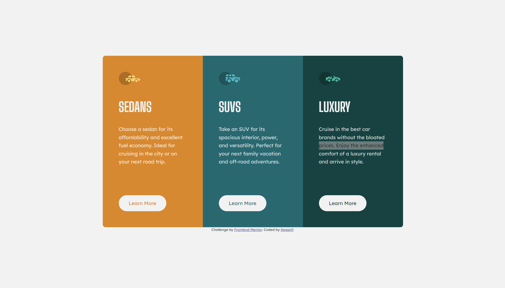

# Frontend Mentor - 3-column preview card component solution

This is a solution to the [3-column preview card component challenge on Frontend Mentor](https://www.frontendmentor.io/challenges/3column-preview-card-component-pH92eAR2-). Frontend Mentor challenges help you improve your coding skills by building realistic projects. 

## Table of contents

- [Overview](#overview)
  - [The challenge](#the-challenge)
  - [Screenshot](#screenshot)
- [My process](#my-process)
  - [Built with](#built-with)
  - [Continued development](#continued-development)
- [Author](#author)

## Overview

### The challenge

Users should be able to:

- View the optimal layout depending on their device's screen size
- See hover states for interactive elements

### Screenshot

## My process

### Built with

- Semantic HTML5 markup
- CSS custom properties
- CSS Grid
- Mobile-first workflow

### Continued development

A couple of things I want to learn more about going forward:

- Flexbox and flexbox use cases. While I was working on this I wasn't sure if it was better to use grid or flexbox to structure the contents of the cards. I ended up sticking with grid for now, but as I continue learning about flexbox, I'll come back and update this if turns out to be a more appropriate solution. 

- Responsive design and media queries. I want to learn more about the best ways to utilize `@media` when creating responsive layouts. 

## Author

- Frontend Mentor - [@KeganF](https://www.frontendmentor.io/profile/KeganF)

